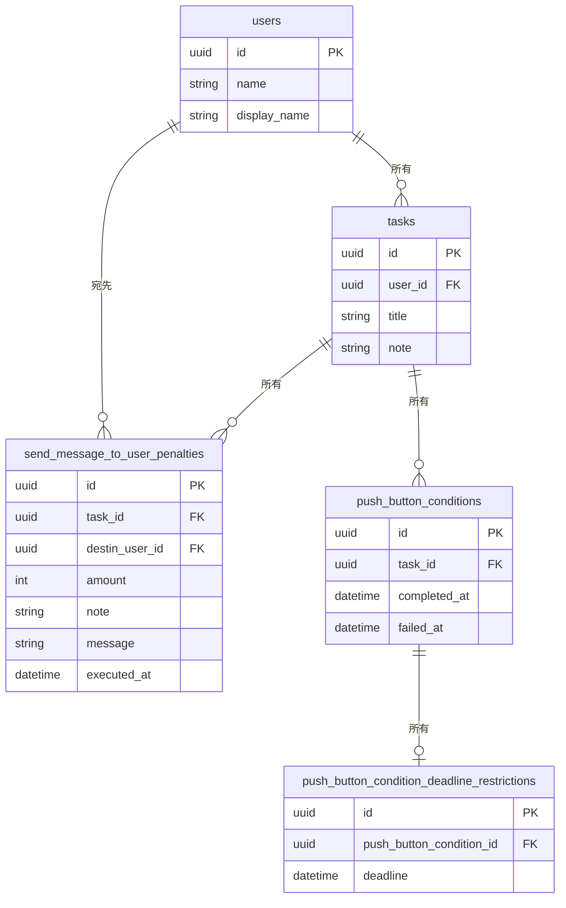

# Promise-Executioner API

## 概要

本アプリケーションのサーバーサイドで稼働し、ドメインロジックの演算、他のサービスとの中継、データベースとの接続を行う。

## 環境

- Swift 5.8
- [Vapor 4](https://vapor.codes)
- PostgreSQL 15

## 開発環境構築

1. Xcodeのインストール
1. Postgreでサーバー用とテスト用のデータベースを用意
1. open Package.swift
1. Xcodeの[Custom Working Directoryの設定](https://docs.vapor.codes/getting-started/xcode/#custom-working-directory)
1. `cp example.env .env.testing`して設定
1. `cp example.env .env`して設定
1. Xcodeの実行引数に`migrate`を追加して実行
1. Xcodeの実行引数に`migrate --env testing`を追加して実行
1. Xcodeの実行引数をなくして実行し、サーバーを立てる
1. ⌘uで全てのテストを実行する

## ディレクトリ構成

- Source: プログラムファイルディレクトリ
    - App: サーバー実行ディレクトリ
        - Controllers: コントローラー
    - Entity: ドメインモデル
    - Persistence: データベース実装
        - Migration: テーブル操作クエリ
        - Model: ORMモデル
        - Repository: リポジトリの実装
    - Repository: 永続仮想のprotocol
    - Testing: テストで使用する擬似値
    - Usecase: ユースケース
- Tests: テストディレクトリ

## Database設計

